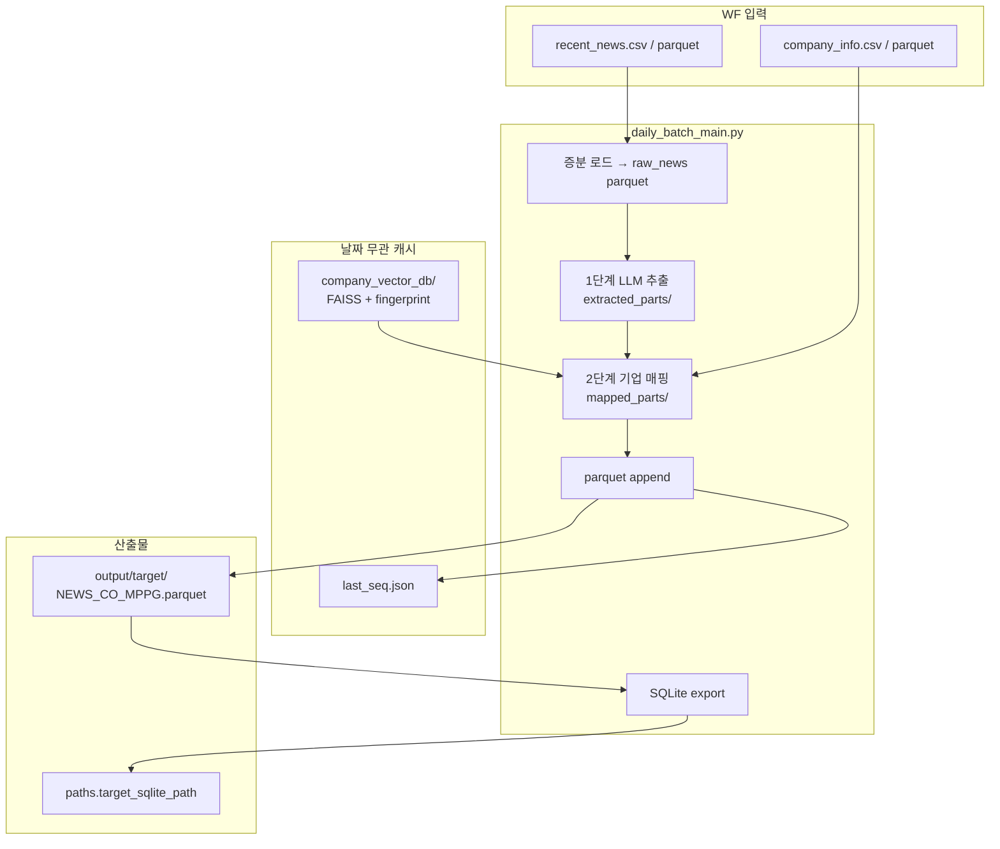
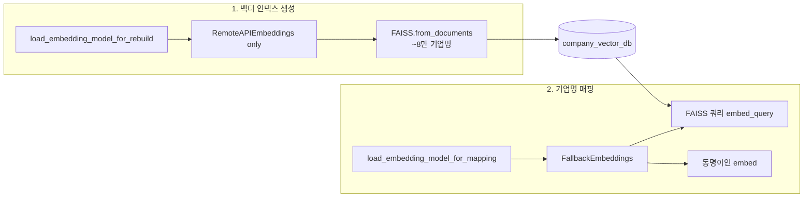

# LLM News Analysis Pipeline — Architecture

이 문서는 `news_data` 프로젝트의 **현재 코드 기준** 아키텍처를 설명합니다.

## 1. 시스템 개요

### 1.1 목적

워크플로우(WF)가 공유 스토리지에 내려놓은 **뉴스·기업 마스터 파일**을 읽어:

1. LLM으로 기사별 **기업명·분류·요약** 추출
2. 내부 기업 마스터와 **매핑** (정규화 exact match + FAISS + 동명이인 해소)
3. 결과를 **누적 parquet**에 append하고, downstream용 **SQLite**로 export

하는 **일 단위 배치 파이프라인**입니다.

### 1.2 운영 경계

| 구분 | Hive JDBC | WF 파일 입력 |
|------|-----------|--------------|
| **`daily_batch_main.py` (운영 배치)** | 사용 안 함 | `paths.news_source_path`, `paths.company_info_path` |
| **`scripts/*.py` (보조)** | `database/hive_client.py` | Hive → parquet 덤프 등 일회성 작업 |

운영 배치는 WF가 drop한 CSV/parquet만 읽습니다. Hive 접근이 필요하면 `scripts/` + `conf/hive.yaml`(선택)을 사용합니다.

### 1.3 설계 목표

- **증분 처리**: `seq` + `part_basc_dt` 기준 신규 뉴스만 처리
- **재시작 가능**: 청크별 중간 parquet + `batch_checkpoint.json`, `BATCH_RUN_DATE`로 당일 run 재개
- **장애 격리**: LLM/임베딩 API 일시 장애가 전체를 중단시키지 않도록 방어 (매핑 임베딩 fallback 등)
- **산출물 분리**: parquet = source of truth (전건 보존), SQLite = downstream 필터본

### 1.4 배포·실행

- **진입점**: `daily_batch_main.py` → `main()` → `asyncio.run(run_daily_batch())`
- **외부 호출**: Blueprint 등 WF에서 `from daily_batch_main import main` 후 `main()` 호출
- **설정**: Hydra `compose(config_name="config")`, CWD 무관 (`project_root()/conf` 기준)

---

## 2. End-to-End 데이터 흐름



### 2.1 단계별 요약

| 단계 | 입력 | 출력 | 담당 |
|------|------|------|------|
| 0. 설정 | `conf/config.yaml` | cfg 객체 | Hydra, `pipelines/common/paths.py` |
| 1. 증분 로드 | WF 뉴스 파일 | `daily_batch/{YYYYMMDD}/raw_news_*.parquet` | `database/news_source.py` |
| 2. LLM 추출 | raw parquet (청크) | `extracted_parts/part_*.parquet` | `pipelines/news/extraction.py` |
| 3. 기업 매핑 | extracted + 기업 마스터 | `mapped_parts/mapped_part_*.parquet` | `pipelines/company/mapping_service.py` |
| 4. 적재 | essential + cust_no | target parquet append | `database/parquet_store.py` |
| 5. 체크포인트 | max seq | `last_seq.json` (배치 **완료 후**만) | `pipelines/common/checkpoint.py` |
| 6. SQLite | target parquet 전체 | `.db` 덮어쓰기 | `database/sqlite_store.py` |
| 7. 정리 | WF input CSV | 삭제 (parquet 입력은 유지) | `cleanup_wf_input_csvs()` |

---

## 3. 디렉터리 구조

```
news_data/
├── daily_batch_main.py              # 배치 오케스트레이터
├── conf/
│   ├── config.yaml                  # 운영 설정 (gitignore 가능)
│   └── config.example.yaml          # 템플릿
├── database/
│   ├── wf_csv.py                    # WF CSV 파서 (\x01 / ||)
│   ├── news_source.py               # 뉴스 로드 + 증분 필터
│   ├── company_source.py            # 기업 마스터 로드
│   ├── parquet_store.py             # target parquet append
│   ├── sqlite_store.py              # parquet → SQLite
│   ├── schema.py                    # NEWS_CO_MPPG 컬럼 정의
│   └── hive_client.py               # Hive JDBC (scripts 전용)
├── models/
│   ├── invoke.py                    # LLM AsyncOpenAI 호출
│   └── embedding.py                 # API / local / FallbackEmbeddings
├── pipelines/
│   ├── common/
│   │   ├── checkpoint.py            # last_seq + batch_checkpoint
│   │   └── paths.py                 # config 경로 → 절대경로
│   ├── news/
│   │   └── extraction.py            # LLM 배치 추출
│   └── company/
│       ├── mapping_service.py       # FAISS, 매칭, 동명이인, dedup
│       └── preprocess.py            # cust_no 최신 1건, 컬럼 정리
├── prompts/
│   ├── news_prompt.py               # 운영 프롬프트 (저장소 미포함)
│   └── news_prompt.example.py
├── queries/sql_queries.py           # Hive SQL (scripts 전용)
├── scripts/                         # Hive 덤프·복구 보조
├── log/logger.py                    # 파일+콘솔, 14일 retention
└── output/                          # gitignore
    ├── checkpoint/last_seq.json
    ├── target/NEWS_CO_MPPG.parquet
    ├── company_vector_db/           # FAISS 캐시
    └── daily_batch/{YYYYMMDD}/
        ├── raw_news_*.parquet
        ├── extracted_parts/
        ├── mapped_parts/
        └── batch_checkpoint.json
```

---

## 4. 입력: WF 파일 형식

### 4.1 공통 리더 (`database/wf_csv.py`)

| 항목 | 값 |
|------|-----|
| 필드 구분자 | 리터럴 4글자 `\x01` (바이트 0x01 아님) |
| 레코드 구분자 | `\|\|` |
| parquet | `pd.read_parquet` |
| 디렉터리 | 내부 `*.csv` 또는 `*.parquet` glob 후 concat |

컬럼 수 불일치 레코드는 경고 후 제외합니다.

### 4.2 뉴스 증분 필터 (`database/news_source.py`)

`load_recent_news(path, last_seq, last_part_basc_dt)`:

- `channel == 'NEWS'` (컬럼 있을 때)
- `seq == p_seq` (컬럼 있을 때)
- `title` 비어 있지 않음
- `seq > last_seq`
- `part_basc_dt >= last_part_basc_dt`

### 4.3 기업 마스터 (`database/company_source.py`)

- `read_wf_source`로 로드
- `cust_no` → string (앞자리 0 보존)
- 이후 `preprocess.py`: `lst_ases_dt` 최신 1건 / 필요 컬럼만 유지

---

## 5. 오케스트레이터 (`daily_batch_main.py`)

### 5.1 체크포인트 (2종)

| 파일 | 키 | 갱신 시점 | 용도 |
|------|-----|-----------|------|
| `output/checkpoint/last_seq.json` | `last_seq`, `last_part_basc_dt` | 배치 **전체 성공 후** | run 간 증분 커서 |
| `daily_batch/{date}/batch_checkpoint.json` | `last_extracted_chunk`, `last_mapped_chunk` | **청크마다** | 당일 run 내 재개 |

### 5.2 재개 (`BATCH_RUN_DATE`)

```bash
export BATCH_RUN_DATE=20260702   # 실패한 run 날짜
python daily_batch_main.py
```

- 같은 날짜 폴더의 `raw_news`, `extracted_parts` 재사용
- 추출 완료분은 LLM **재호출 없이 skip**
- 매핑은 `last_mapped_chunk + 1`부터 재개

### 5.3 배치 파라미터 (`batch.*`)

| 키 | 의미 |
|----|------|
| `chunk_size` | parquet iter_batches / 처리 단위 (기본 1000) |
| `concurrent_limit` | LLM 동시 호출 상한 |
| `similarity_threshold` | FAISS 유사도 임계값 (기본 0.9) |
| `dry_run` | true 시 append 직전 미리보기 후 `sys.exit(0)` |

### 5.4 WF 입력 정리

배치 **정상 완료** 후 `cleanup_wf_input_csvs()`:

- `news_source_path`, `company_info_path`가 **`.csv`일 때만** 삭제
- `.parquet` 등은 삭제하지 않음

---

## 6. 1단계: LLM 추출

### 6.1 흐름

```
raw_news parquet
  → iter_batches(chunk_size)
  → process_chunk() [asyncio + Semaphore]
  → part_{idx:05d}.parquet 저장
  → checkpoint last_extracted_chunk 갱신
```

### 6.2 `pipelines/news/extraction.py`

뉴스 1건당 LLM JSON 추출:

- `company_names`, `classification` (essential / noise)
- `category`: FINANCE, BUSINESS, MANAGEMENT, INDUSTRY, RISK, NOISE
- `summary`, `reference`

**방어**:

- markdown JSON fence 제거, 괄호 불균형 보정
- API/파싱 실패 → 빈 결과 + `llm_error` (배치 계속)

### 6.3 `models/invoke.py`

- `AsyncOpenAI(base_url=serve.online.url + serve.online.model)`
- `responses.create()` — instructions / input, reasoning effort

---

## 7. 2단계: 기업 매핑

### 7.1 전처리

```python
companies_df = load_company_info(...)
companies_df = keep_latest_per_cust_no(companies_df)
companies_df = rename_companies_df_columns(companies_df)
companies_df["clean_cust_nm"] = normalize_company_name(cust_nm)
```

`normalize_company_name`: (주)/주식회사 제거, 공백·특수문자 정리, 짧은 영문·한글 혼합 시 알파벳→한글 음역 등.

### 7.2 매칭 파이프라인 (`process_one_chunk`)

```
company_names explode → target_company
    │
    ├─ [1] exact: clean_target == clean_cust_nm  (score=1.0)
    │
    └─ [2] FAISS: similarity_search_with_relevance_scores (≥ threshold)
            │
            └─ resolve_homonyms: (seq, target_company) 중복 시
               뉴스 문맥 vs 업종/주제품 임베딩 코사인으로 1건 선택
    │
    └─ classification == essential 필터 (daily_batch_main)
    └─ (seq, cust_no) drop_duplicates
```

---

## 8. 임베딩 아키텍처 (핵심)

임베딩은 **용도별로 두 갈래**로 분리됩니다. 모델은 운영 기준 **bge-m3** (API: `SentenceTransformer` + `normalize_embeddings=True`, local: `HuggingFaceEmbeddings` 동일 normalize).

### 8.1 개념도



### 8.2 ① 벡터 인덱스 생성 — `load_embedding_model_for_rebuild`

**함수**: `models/embedding.py` → `build_or_load_company_vector_db()`에서 **인덱스 빌드 시만** 사용.

**fingerprint**: `cust_no` 집합 MD5 → `{count}:{digest}` → `company_fingerprint.txt`

| 상황 | 동작 |
|------|------|
| 마스터 **동일** + 캐시 있음 | 재빌드 없음 → `FAISS.load_local` |
| 마스터 **변경** + API 성공 | API로 전건 `from_documents` → fingerprint 갱신 |
| 마스터 **변경** + API 실패 + **구 캐시 있음** | **구 FAISS 유지** (fingerprint 미갱신, 마스터 변경 미반영) |
| 마스터 **변경** + API 실패 + 캐시 없음 | `RuntimeError` |
| 캐시 **손상**(load 실패) + API 실패 | `RuntimeError` (깨진 캐시 재사용 안 함) |

**의도**: 로컬 CPU로 8만건 cold-start 재빌드(~수 시간)를 **운영에서 피함**.

재빌드 성공 후 `_finalize_new_vector_db()`:

- `db.embedding_function = mapping_embeddings` (FallbackEmbeddings)
- 저장 시 쿼리 경로도 매핑용 fallback과 일치

### 8.3 ② 기업명 매핑 — `load_embedding_model_for_mapping`

**함수**: `FallbackEmbeddings` (`embedding_mode=api`일 때)

| 호출 | 용도 |
|------|------|
| `vector_db.similarity_search_*` | unmapped 기업명 → FAISS top-1 |
| `resolve_homonyms` | 동명이인 후보 간 문맥 비교 |

**정책**:

1. 매 `embed_documents` / `embed_query`마다 **API 우선**
2. 예외 발생 시 **로컬 bge-m3 로드** → `_use_local=True` (배치 세션 내 sticky)
3. `embedding_mode=local` → 처음부터 로컬만

API 장애 시 매핑은 **느려질 수 있으나** 중단되지 않도록 설계 (인덱스는 API로 만들어진 벡터, 쿼리는 fallback local — 동일 bge-m3·normalize 전제).

---

## 9. 적재 레이어

### 9.1 Target parquet (`database/parquet_store.py`)

- 경로: `paths.target_parquet_dir` + `paths.target_parquet_file`
- `news_mppg_id`: 기존 MAX+1 순차 부여
- `basc_dt`: `YYYY.MM.DD` 문자열 통일
- **NOISE 필터 없음** — parquet는 전체 이력

### 9.2 SQLite (`database/sqlite_store.py`)

배치 마지막에 target parquet **전체**를 `.db`로 replace.

**제외 행** (downstream 신용평가용):

- `news_clas` ∈ {NOISE, None, 빈값}
- `doc_sentiment` None / 빈값

### 9.3 컬럼 매핑

내부 작업명 → Hive DDL명 (`daily_batch_main.py` `COLUMN_RENAME`):

| 내부 | 적재 컬럼 |
|------|-----------|
| `site_name` | `site_nm` |
| `title` | `news_tite` |
| `content` | `news_ctt` |
| `category` | `news_clas` |
| `summary` | `news_summ` |
| `reference` | `news_ref` |
| `cust_no` | `etct_cust_no` |
| `cust_nm` | `etct_cust_nm` |

스키마 전체: `database/schema.py` (`TARGET_COLUMNS`, `VALID_NEWS_CLAS`).

---

## 10. 설정 (`conf/config.yaml`)

배치 config에는 **`hive` / `tables` 섹션 없음**.

| 섹션 | 용도 |
|------|------|
| `paths.*` | WF 입력, target, daily 출력, vector DB, checkpoint, log |
| `batch.*` | chunk, concurrency, threshold, dry_run |
| `serve.online.*` | LLM URL, model, temperature, reasoning |
| `serve.embedding.*` | GPU 임베딩 API (OpenAI 호환 `/embeddings`) |
| `dev.embedding_mode` | `api` \| `local` |
| `dev.paths.embedding_model` | local / fallback용 HuggingFace 경로 |
| `dev.system.device` | `cpu` \| `cuda` |
| `dev.params.embed_batch_size` | API·로컬 배치 크기 |

Hive 보조: `scripts/hive_config.py`가 `config.yaml` + 선택 `conf/hive.yaml` merge.

---

## 11. 보조 스크립트 (`scripts/`)

| 스크립트 | 용도 |
|----------|------|
| `dump_recent_news.py` | Hive 뉴스 → parquet |
| `load_companies_table.py` | Hive 기업 마스터 → parquet |
| `snapshot_hive_table.py` | Hive 타깃 스냅샷 |
| `repair_parquet_column_shift.py` | parquet 컬럼 shift 복구 |
| `hive_config.py` | config merge |

**운영 배치 경로에 포함되지 않음.**

---

## 12. 장애·재실행 시나리오

| 시나리오 | 1번 인덱스 | 2번 매핑 | 재실행 |
|----------|------------|----------|--------|
| API 정상 | 캐시 재사용 또는 API 재빌드 | API | — |
| API down, 마스터 동일 | 캐시 재사용 | **로컬 fallback** | `BATCH_RUN_DATE`로 매핑부터 |
| API down, 마스터 변경 | **구 캐시 유지** | **로컬 fallback** | fingerprint 불일치 상태 유지 → API 복구 시 재빌드 시도 |
| 매핑 중간 실패 | — | — | `last_mapped_chunk` 미갱신 구간부터 |
| 배치 미완료 | — | — | `last_seq` **미갱신** → 동일 뉴스 재처리 가능 |
| 신규 뉴스 0건 | — | — | 조기 종료 + WF CSV cleanup |

---

## 13. 기술 스택

| 영역 | 라이브러리 |
|------|-----------|
| 설정 | Hydra, OmegaConf |
| 데이터 | Pandas, PyArrow |
| WF 입력 | 커스텀 CSV 파서 |
| Hive (보조) | jaydebeapi |
| LLM | OpenAI Python SDK (AsyncOpenAI, responses API) |
| 임베딩 | LangChain Embeddings, HuggingFace, OpenAI Embeddings API |
| 벡터 검색 | LangChain FAISS, scikit-learn cosine_similarity |
| downstream | SQLite3 |
| 비동기 | asyncio |

---

## 14. 실험·디버깅

| 노트북 | 용도 |
|--------|------|
| `debug_check_mapping.ipynb` | 매핑률, `(seq, etct_cust_no)` 중복 검증 |
| `benchmark_embedding.ipynb` | GPU API vs CPU FAISS cold-start |
| `compare_company_info.ipynb` | CSV vs parquet 기업 마스터 비교 |

노트북 config는 Hydra struct 이슈 회피를 위해 `OmegaConf.load` 사용 권장.

---

## 15. 설계 트레이드오프

1. **청크 parquet**: 디스크 ↑, LLM·매핑 분리·재시작 비용 ↓
2. **WF 파일 입력**: 배치 노드 Hive JDBC 불필요
3. **parquet 누적 + SQLite export**: Hive 직접 INSERT 대신 파일 기반 downstream
4. **parquet vs SQLite 필터 분리**: 감사·재처리용 전건 vs 서비스용 필터본
5. **FAISS fingerprint = cust_no 집합**: 이름만 바뀌면 재빌드 안 함; cust 추가/삭제 시 전체 재빌드 (incremental 미구현)
6. **임베딩 1/2 분리**: cold-start는 API-only + stale cache; 매핑은 API→local fallback으로 가용성 확보

---

## 16. 관련 문서

- [README.md](./README.md) — 프로젝트 소개 (일부 Hive 중심 설명은 레거시, 본 문서 우선)
- [conf/config.example.yaml](./conf/config.example.yaml) — 설정 템플릿
- [prompts/news_prompt.example.py](./prompts/news_prompt.example.py) — LLM 출력 스키마
