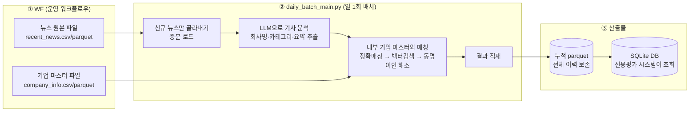
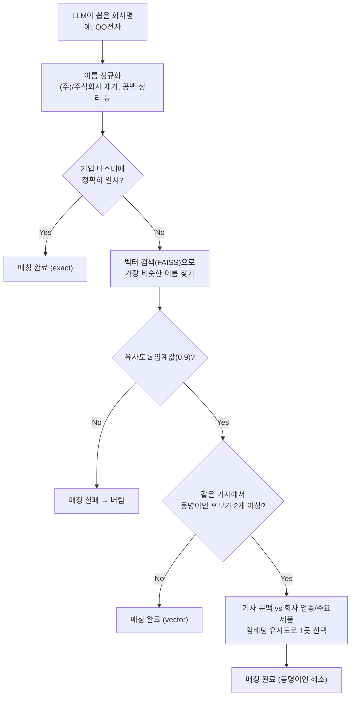

# 뉴스 데이터 파이프라인 — 운영 가이드 (내부 공유용)

> 이 문서는 `news_data` 배치가 **운영에 반영**되는 시점에, 내부 구성원(운영 담당자·유관 개발자·인수자)이
> "이게 무엇을 하고, 왜 이렇게 동작하고, 문제가 생기면 뭘 봐야 하는지"를 빠르게 파악하도록 쓴 실무용 문서입니다.
>
> - 코드 구조·설계 이유가 궁금하면 → [ARCHITECTURE.md](../ARCHITECTURE.md)
> - 최소 실행법만 필요하면 → [README.md](../README.md)
> - 이 문서는 위 두 문서를 참고해 **"운영 관점 이해 + 장애 대응"** 에 초점을 맞췄습니다.

---

## 0. 요약 (30초 버전)

- **무엇을 하나**: 매일 새로 들어온 뉴스 기사를 읽어서, LLM으로 "이 기사에 나온 회사가 누구고, 신용평가에 의미 있는 뉴스인지, 어떤 카테고리인지"를 뽑아내고, 내부 기업 마스터(거래기업 번호)와 매칭해서 DB에 쌓는 **일 1회 배치**입니다.
- **왜 필요한가**: 여신/신용평가 담당 부서가 "이 기업 관련 뉴스가 있었는지, 긍정/부정적인지"를 사람이 일일이 뉴스를 찾아보지 않고 시스템에서 조회할 수 있게 하기 위함입니다.
- **입력**: 워크플로우(WF)가 공유 경로에 떨궈주는 뉴스 파일 + 기업 마스터 파일 (Hive에 직접 붙지 않습니다)
- **출력**: 신용평가 다운스트림 시스템이 조회하는 `SQLite` DB (+ 원본 보존용 parquet)
- **하루 한 번, 자동으로 돌고, 실패해도 이어서 재시작 가능**하도록 설계되어 있습니다.

---

## 1. 이 파이프라인은 왜 존재하나 (배경)

여신/신용평가 담당자는 특정 거래기업에 대해 "최근 이 회사 관련 안 좋은 뉴스가 있었는지"를 확인해야 합니다.
이를 매번 사람이 뉴스를 검색해서 판단하는 대신, 다음을 **자동화**한 것이 이 배치입니다.

1. 매일 쏟아지는 뉴스 기사 중에서 **신용평가에 의미 있는 기사만 골라내고** (essential vs noise)
2. 기사 안에 언급된 회사명을 **내부 기업 마스터(거래기업번호, `cust_no`)와 연결**하고
3. 기사를 **카테고리(재무/영업/경영/산업/리스크)와 요약**으로 정리해서
4. 신용평가 시스템이 조회할 수 있는 **DB 테이블**로 쌓아 둡니다.

즉 "뉴스 원문 → 이 회사에 대한 이야기인가? → 무슨 종류의 이야기인가?"를 LLM과 벡터 검색으로 자동화한 파이프라인입니다.

---

## 2. 전체 그림



핵심 문장 3개로 요약하면:

1. **뉴스가 늘어난 만큼만** 처리한다 (전체 재처리 안 함 → "증분 처리")
2. LLM·매핑 결과를 **중간중간 파일로 저장**해서, 배치가 중간에 죽어도 처음부터 다시 안 해도 된다 ("재시작 가능")
3. **원본은 parquet에 전부 보존**하고, 신용평가 시스템이 보는 SQLite에는 **의미 있는 데이터만 필터링**해서 넣는다.

---

## 3. 단계별 상세 (실제 데이터가 어떻게 바뀌는지)

### 3.1 입력 — WF가 주는 두 개의 파일

| 파일 | 내용 | 형식 |
|------|------|------|
| 뉴스 원본 (`paths.news_source_path`) | 최근 며칠치 뉴스 원문 (`seq`, `title`, `content`, `basc_dt` 등) | CSV(`\x01`/`\|\|` 구분자) 또는 parquet |
| 기업 마스터 (`paths.company_info_path`) | 내부 거래기업 목록 (`cust_no`, `cust_nm`, 업종 등) | CSV 또는 parquet |

- 운영 배치(`daily_batch_main.py`)는 **Hive에 직접 연결하지 않습니다.** WF가 미리 파일로 떨궈주는 것만 읽습니다.

### 3.2 1단계 — 신규 뉴스만 골라내기 (증분 로드)

같은 파일을 매일 다시 전부 처리하면 낭비이므로, "저번에 어디까지 처리했는지"를 기억해 그 이후 것만 가져옵니다.

- 기억하는 위치: `output/checkpoint/last_seq.json` (`last_seq`, `last_part_basc_dt`)
- 조건: `seq > last_seq` **그리고** `part_basc_dt >= last_part_basc_dt`, 제목이 비어있지 않은 것만
- 결과가 0건이면 → 바로 배치를 끝냅니다 (LLM 호출 자체를 안 함, 비용 절약)

> 이 체크포인트는 **배치가 끝까지 성공했을 때만** 갱신됩니다. 중간에 실패하면 다음 실행 시 같은 뉴스를 다시 봅니다(중복 처리는 되어도 데이터 유실은 없도록 하는 설계).

### 3.3 2단계 — LLM으로 기사 분석 (추출)

신규 뉴스를 1000건(`batch.chunk_size`) 단위로 잘라서, 기사 1건당 LLM을 한 번 호출합니다.

**예시 입력 (기사 1건)**

```text
제목: OO전자, 3분기 영업이익 전년比 20% 증가
본문: OO전자는 3분기 실적을 발표하며...
```

**LLM이 뽑아내는 것 (JSON)**

```json
{
  "company_names": ["OO전자"],
  "classification": "essential",
  "category": "FINANCE",
  "summary": "OO전자가 3분기 영업이익이 전년 대비 20% 증가했다고 발표함."
}
```

| 필드 | 의미 |
|------|------|
| `company_names` | 제목에 등장하는 회사명 목록 (본문에만 나오면 제외, 은행/금융그룹·관공서·개인·학교·병원은 제외) |
| `classification` | `essential`(신용평가에 의미 있음) / `noise`(광고·부고·인사·연예 등 무의미) |
| `category` | `FINANCE`/`BUSINESS`/`MANAGEMENT`/`INDUSTRY`/`RISK`/`NOISE` 6종 중 하나 |
| `summary` | 한 줄 요약 (한국어) |

**LLM 응답이 깨졌을 때**: markdown 코드블록 제거, 괄호 짝이 안 맞으면 보정 시도. 그래도 파싱이 안 되면 그 기사는 `llm_error`만 채워서 **배치 전체를 멈추지 않고 계속 진행**합니다.

청크 단위로 처리 결과를 `extracted_parts/part_00000.parquet` 형태로 즉시 저장합니다 → 나중에 매핑 단계가 실패해도 LLM을 다시 부를 필요가 없습니다.

### 3.4 3단계 — 내부 기업 마스터와 매칭

LLM이 뽑은 `"OO전자"` 라는 문자열은 아직 우리 시스템의 어떤 거래기업(`cust_no`)인지 모릅니다. 이를 연결하는 단계입니다.



- **왜 벡터 검색이 필요한가**: 뉴스에는 "OO전자(주)", "OO전자㈜", 약칭 등 표기가 제각각입니다. 정확히 문자열이 같지 않아도 의미상 같은 회사면 찾아줘야 하기 때문에, 회사명을 임베딩(의미 벡터)으로 바꿔 저장해두고(FAISS 인덱스) 유사도로 검색합니다.
- **동명이인 문제**: "한국전자"처럼 이름이 겹치는 회사가 여러 개면, 기사 본문 내용과 각 회사의 업종/주요제품이 얼마나 비슷한지를 비교해서 가장 그럴듯한 1곳만 선택합니다.
- 최종적으로 `classification == essential` 이면서 `cust_no`가 매칭된 것만 다음 단계로 넘어갑니다.

### 3.5 4단계 — 적재

| 저장소 | 내용 | 필터 |
|--------|------|------|
| **누적 parquet** (`output/target/NEWS_CO_MPPG.parquet`) | 매칭에 성공한 모든 이력 | NOISE 포함 **전건 보존** (감사·재처리 대비) |
| **SQLite** (`paths.target_sqlite_path`) | 신용평가 시스템이 실제로 조회하는 DB | parquet 전체 중 `news_clas`가 NOISE/빈값이거나 `doc_sentiment`가 없는 행은 **제외** |

즉 parquet은 "우리가 처리한 모든 기록", SQLite는 "신용평가 서비스에 실제로 노출되는 정제본" 입니다. 매 배치마다 parquet 전체를 다시 읽어 SQLite를 덮어씁니다.

**내부 작업명 → 실제 DB 컬럼명** (다운스트림 Hive 테이블 규격에 맞춘 변환)

| 내부에서 쓰는 이름 | DB 컬럼명 | 설명 |
|---|---|---|
| `site_name` | `site_nm` | 언론사 |
| `title` | `news_tite` | 제목 |
| `content` | `news_ctt` | 본문 |
| `category` | `news_clas` | 카테고리(6종) |
| `summary` | `news_summ` | 요약 |
| `cust_no` | `etct_cust_no` | 거래기업번호 |
| `cust_nm` | `etct_cust_nm` | 거래기업명 |

전체 컬럼 목록은 `database/schema.py`의 `TARGET_COLUMNS`를 참고하세요.

---

## 4. 운영 방법

### 4.1 언제, 어떻게 실행되나

- **실행 방식**: 외부 스케줄러(WF)가 하루 한 번 `python daily_batch_main.py`를 실행하거나, `from daily_batch_main import main; main()`으로 호출.
- **선행 조건**: WF가 해당일 뉴스/기업 마스터 파일을 지정 경로에 미리 떨궈놔야 합니다. 파일이 없으면 배치가 정상적으로 처리할 데이터가 없습니다.
- **소요 시간**: 신규 뉴스 건수·LLM 응답 속도에 비례. LLM 호출은 `batch.concurrent_limit`(기본 50)개까지 동시에 진행합니다.

### 4.2 설정 파일 한 번에 보기 (`conf/config.yaml`)

`conf/config.example.yaml`을 복사해서 운영값을 채웁니다 (`cp conf/config.example.yaml conf/config.yaml`).

| 섹션 | 키 | 의미 | 운영 시 주의 |
|------|----|------|--------------|
| `paths` | `news_source_path` / `company_info_path` | WF가 파일을 두는 경로 | WF와 경로 합의 필요 |
| `paths` | `target_sqlite_path` | 다운스트림이 조회할 DB 경로 | **공유 스토리지 경로** — 운영망 기준으로 채워야 함 |
| `paths` | `vector_db_dir` | 회사 벡터 인덱스 캐시 | 지우면 다음 배치에서 전체 재빌드(수 시간) 발생 가능 |
| `batch` | `chunk_size` | 처리 단위 (기본 1000) | 너무 크면 실패 시 재작업 단위가 커짐 |
| `batch` | `concurrent_limit` | LLM 동시 호출 수 (기본 50) | LLM 서버 사양에 맞춰 조정 |
| `batch` | `similarity_threshold` | 벡터 매칭 임계값 (기본 0.9) | 낮추면 매칭 건수↑·오매칭 위험↑ |
| `batch` | `dry_run` | `true`면 실제 적재 없이 미리보기만 하고 종료 | **운영에서는 반드시 `false`** |
| `serve.online.*` | LLM 서버 URL/모델 | 뉴스 분석용 LLM | LLM 서버 상태와 직결 |
| `serve.embedding.*` | 임베딩 API URL | 기업명 벡터화용 GPU 서버 | §4.4 임베딩 이원화 참고 |
| `dev.embedding_mode` | `api` / `local` | 임베딩을 API로 부를지, 로컬 모델로 돌릴지 | 운영은 `api` 권장 |

민감한 프롬프트(`prompts/news_prompt.py`)와 실제 설정(`conf/config.yaml`)은 저장소에 커밋되지 않습니다(`.gitignore`). 운영 배포 시 별도로 채워야 합니다.

### 4.3 로그·산출물 확인 위치

| 확인하고 싶은 것 | 위치 |
|---|---|
| 오늘 배치가 뭘 했는지 (로그) | `log/files/daily_batch_{YYYYMMDD}.log` (14일 보관 후 자동 삭제) |
| 오늘 배치의 중간 산출물 | `output/daily_batch/{YYYYMMDD}/` (raw_news, extracted_parts, mapped_parts, checkpoint) |
| 지금까지 누적된 전체 결과 | `output/target/NEWS_CO_MPPG.parquet` |
| 신용평가 시스템이 보는 최종 데이터 | `paths.target_sqlite_path` |
| 어디까지 처리했는지 커서 | `output/checkpoint/last_seq.json` |

로그는 배치 종료 시 아래 형태로 요약을 남깁니다 — 운영 모니터링 시 이 블록만 봐도 그날 배치 상태를 알 수 있습니다.

```text
========== 일배치 종료 ==========
  덤프 데이터 크기:         12,345건
  기업명 추출 성공:         9,800건
  기업 매핑 성공:           7,200건
  parquet append 성공:      6,900건
  소요시간:                 1523.42초
```

### 4.4 임베딩(GPU API) 이원화 — 운영자가 꼭 알아야 할 부분

임베딩(회사명을 의미 벡터로 바꾸는 작업)은 **용도가 두 가지**이고, 장애 대응 방식이 다릅니다.

| 용도 | 시점 | API 장애 시 동작 |
|------|------|------------------|
| ① 회사 벡터 인덱스 **생성/재생성** (기업 전체) | 기업 마스터가 바뀌었을 때만 | API 실패 시 **기존 인덱스를 그대로 유지**하고 마스터 변경분은 반영 안 함 (로컬 GPU 없는 서버에서 8만건 재계산은 너무 오래 걸려서 일부러 재빌드 안 함). 캐시도 없으면 배치 에러로 중단.
| ② 매일 기업명 매칭 시 검색어 임베딩 | 매 배치 | API 실패 시 **로컬 모델로 자동 전환**해서 배치는 계속 진행 (느려질 수 있음)

즉 "①인덱스 생성"은 API가 필수(장애 시 대응 없이 구 상태 유지)이고, "②매칭"은 API가 죽어도 로컬로 자동 대체되어 배치가 멈추지 않습니다. 자세한 내용은 [ARCHITECTURE.md §8](../ARCHITECTURE.md#8-임베딩-아키텍처-핵심) 참고.


---

## 5. 실패했을 때 — 운영 대응 (Runbook)

### 5.1 실패 재개의 기본 원리

배치는 **오늘 날짜 폴더**(`output/daily_batch/{YYYYMMDD}/`) 안에 진행 상황을 청크 단위로 기록합니다. 그래서 어제 실행이 중간에 실패했어도, **같은 날짜로 다시 실행**하면 끝난 부분은 건너뛰고 이어서 진행합니다.

```bash
export BATCH_RUN_DATE=20260702   # 실패했던 run의 날짜(YYYYMMDD)
python daily_batch_main.py
```

- 이미 LLM 추출이 끝난 청크는 **LLM을 다시 호출하지 않고** 건너뜁니다 (비용/시간 절약).
- 매핑은 마지막으로 성공한 청크 다음부터 재개합니다.
- 기본값(환경변수 미설정)은 오늘 날짜이므로, **평소 스케줄 실행에는 이 설정이 필요 없습니다.** 장애 복구 시에만 씁니다.

### 5.2 상황별 대응표

| 상황 | 증상(로그) | 원인 | 대응 |
|------|-----------|------|------|
| LLM 서버 다운 | 특정 기사에 `llm_error` 채워짐, 배치는 끝까지 진행됨 | LLM API 응답 실패 | LLM 서버 복구 후 `BATCH_RUN_DATE`로 같은 날 재실행 → 실패했던 기사만 다시 시도되지는 않으므로(청크 단위 skip), 필요하면 해당 청크의 `extracted_parts/part_*.parquet`를 지우고 재실행 |
| 임베딩 API 다운, 기업 마스터는 안 바뀜 | "기존 vector db 재사용" 로그 | 인덱스는 캐시 재사용 가능하지만 매칭 쿼리 임베딩만 실패 | 매핑이 느려질 뿐 자동으로 로컬 모델로 전환되어 배치는 완료됨. 별도 조치 불필요 |
| 임베딩 API 다운, 기업 마스터가 바뀜 | "기존 인덱스 유지 (마스터 변경 미반영)" 경고 | 신규/변경된 기업이 이번 배치에서는 매칭 후보에 없음 | API 복구 후 재실행 시 자동으로 인덱스 재빌드 시도됨. 급하면 임베딩 서버 우선 복구 |
| 매핑 단계 중간 실패 (서버 재기동 등) | `batch_checkpoint.json`의 `last_mapped_chunk` 확인 | 프로세스 강제 종료, OOM 등 | `BATCH_RUN_DATE`로 같은 날 재실행 → 마지막 성공 청크 다음부터 이어감 |
| 배치가 아예 끝까지 못 감 | `last_seq.json`이 갱신 안 됨 | 위 사유들 복합 | `last_seq`는 **전체 성공 후에만** 갱신되므로, 재실행하면 같은 뉴스를 다시 봐도 데이터가 빠지진 않음 (중복 적재 방지 로직은 §5.3 참고) |
| 신규 뉴스 0건 | "신규 뉴스가 없습니다" 로그 후 바로 종료 | WF 파일이 아직 안 왔거나 이미 다 처리됨 | 정상 동작. WF 파일 도착 시간과 배치 스케줄 타이밍만 확인 |
| WF CSV 컬럼 수 불일치 경고 | `WF CSV 컬럼수(N) 불일치로 제외된 레코드` | 원본 CSV 일부 레코드 깨짐(구분자 안에 개행 등) | 해당 건수가 크면 WF 담당자에게 원본 파일 포맷 확인 요청. 소수면 정상 범위로 간주 가능 |

### 5.3 "재실행하면 중복 적재되지 않나요?"

- 같은 날짜(`BATCH_RUN_DATE`)로 재실행하는 경우: 이미 처리된 청크는 건너뛰므로 **중복 적재 안 됨**.
- 완전히 새로 실행해서 이미 처리된 뉴스를 다시 긁어온 경우: 정상적으로는 `last_seq` 필터로 걸러지지만, 혹시 겹쳐서 들어가더라도 target parquet에는 자체 dedup이 없으므로 **의심되면 `(seq, etct_cust_no)` 기준 중복 여부를 확인**하세요 (`debug_check_mapping.ipynb` 참고).

### 5.4 dry_run으로 안전하게 미리 확인하기

`conf/config.yaml`에서 `batch.dry_run: true`로 설정하면, 매핑까지는 정상 수행하지만 **실제 DB/parquet에 쓰지 않고** 로그로 결과 샘플만 보여주고 종료합니다. 설정 변경(LLM 모델, 임베딩 서버 등) 후 영향도를 확인할 때 유용합니다. **운영 스케줄에는 반드시 `false`여야 합니다.**

---

## 6. 자주 묻는 질문 (FAQ)

**Q. 왜 어떤 기사는 회사명이 뽑혔는데 최종 DB에는 안 보이나요?**
A. 다음 중 하나입니다: ① LLM이 `classification: noise`로 분류(신용평가에 무의미) ② 내부 기업 마스터와 매칭 실패(유사도 0.9 미달) ③ parquet에는 있지만 SQLite export 시 `news_clas`/`doc_sentiment`가 비어 필터링됨. parquet(전건 보존)에서 먼저 확인해보세요.

**Q. 같은 회사인데 표기가 다르면(예: "OO전자" vs "OO전자(주)") 매칭이 되나요?**
A. 됩니다. 이름 정규화(괄호/특수문자 제거) 후 정확 매칭을 먼저 시도하고, 안 되면 벡터 검색으로 유사도 기반 매칭을 시도합니다.

**Q. 신규 거래기업이 추가됐는데 오늘 뉴스에서 매칭이 안 될 수 있나요?**
A. 임베딩 API가 정상이면 기업 마스터 변경이 감지되어 벡터 인덱스가 자동 재생성되므로 매칭됩니다. 다만 임베딩 API가 그 시점에 다운되어 있었다면 §5.2의 "임베딩 API 다운, 마스터 변경" 케이스로, 복구 후 재실행이 필요합니다.

**Q. LLM/임베딩 모델을 바꾸면 뭘 신경 써야 하나요?**
A. LLM 모델 교체는 `serve.online.*`만 바꾸면 되지만 프롬프트 출력 스키마(§3.3)와 호환되는지 확인이 필요합니다. 임베딩 모델을 바꾸면 기존 FAISS 인덱스와 호환되지 않으므로 `output/company_vector_db/`를 지우고 전체 재생성해야 합니다(다운타임/비용 고려).

**Q. 배치를 하루 두 번 돌려도 되나요?**
A. 됩니다. 증분 처리(`last_seq` 기준)라 두 번째 실행 시 신규 뉴스가 없으면 즉시 종료됩니다.

---

## 7. 용어집

| 용어 | 의미 |
|------|------|
| WF (워크플로우) | 이 배치에 앞서 Hive 등 원천에서 뉴스/기업 마스터를 뽑아 공유 경로에 파일로 떨궈주는 상위 시스템 |
| `seq` | 뉴스 기사의 고유 일련번호. 증분 처리의 기준 |
| `part_basc_dt` | 원천 테이블의 파티션 날짜. `seq`와 함께 증분 필터 기준으로 사용 |
| `cust_no` | 거래기업번호 (내부 기업 마스터 PK) |
| `cust_nm` | 거래기업명 |
| `essential` / `noise` | LLM이 판단한 "신용평가에 의미 있는 기사인지" 여부 |
| `category` (`news_clas`) | 기사 성격 6분류: FINANCE/BUSINESS/MANAGEMENT/INDUSTRY/RISK/NOISE |
| FAISS | 회사명을 의미 벡터로 저장해두고 유사도 검색을 하는 벡터 인덱스 라이브러리 |
| fingerprint | 기업 마스터가 바뀌었는지 감지하기 위한 `cust_no` 집합의 해시값 |
| 동명이인 해소 | 이름이 겹치는 여러 회사 후보 중, 기사 문맥과 가장 비슷한 1곳을 고르는 로직 |
| 체크포인트 | 어디까지 처리했는지 기록해두는 파일. `last_seq.json`(배치 간) / `batch_checkpoint.json`(배치 내 청크 단위) |
| `BATCH_RUN_DATE` | 특정 날짜의 중단된 배치를 이어서 재개할 때 쓰는 환경변수 |
| `dry_run` | 실제 적재 없이 결과만 미리 확인하는 모드 |

---

## 8. 관련 문서

- [README.md](../README.md) — 프로젝트 개요 및 빠른 실행법
- [ARCHITECTURE.md](../ARCHITECTURE.md) — 코드 구조·설계 근거 (기술 상세)
- [conf/config.example.yaml](../conf/config.example.yaml) — 설정 템플릿
- `debug_check_mapping.ipynb` — 매핑률·중복 검증용 노트북
